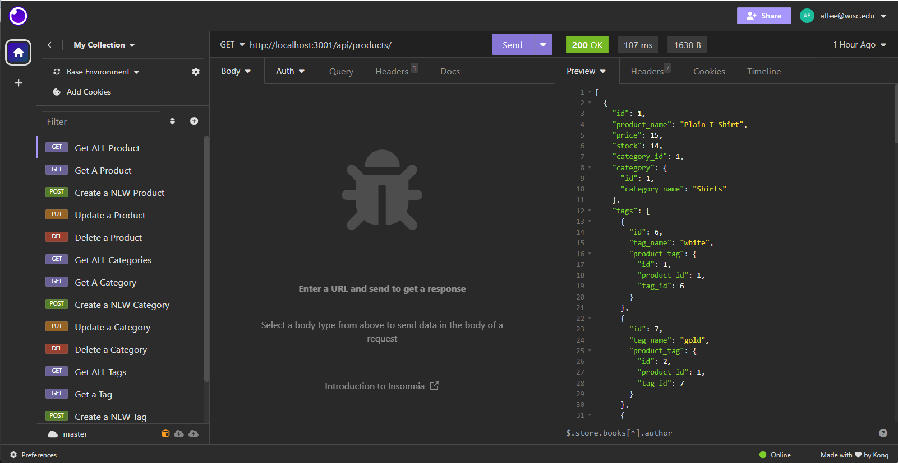

# The E-Commerce Backroom Database by Alan Lee

## Table of Contents

[Description](#description)

[Installation](#installation)

[Usage Information](#usage-information)

[Testing Instructions](#testing-instructions)

[Deployed Website](#deployed-website)

[Questions?](#questions?)

[Contributing](#contributing)

[License](#license)

## Description 
This project was to design and create a simple backend server for an e-commerce database. There is a modular setup of the routers, the seeds, and the models. Sequelize is the npm package of choice that is connected to the mysql database through the schema file. To summarize, users can seed the database, create, edit, get, and delete products items, product categories, and product item tags using simple json objects! This would be perfect for a front end application through buttons or forms to adjust and interact directly with the database. NOTE : much of the code for this database including the setup of the seeds and the overall framework of the application was provided by the EDX Bootcamp through the University of Wisconsin systems! Take this bootcamp! It's worth every penny!

## Installation

    1: Run "npm install" in the integrated terminal to download the npm package modules.

    2: Run "npm run mysql:up" . This will spin up a DOCKER container for the database to work in. For THIS database you MUST have Docker. It is a requirement.

    3:. Run "npm run mysql" in the integrated terminal. When prompted for a password, put the password from teh mysql.yml file OR the .env file into the terminal.

    4: Connect the server to the database in mysql. Run "source ./db/schema.sql" in the mysql terminal line.

    5: Exit mysql with "quit" in the mysql terminal.

    6: Seed the database with the command "npm run seed"

    7: You are ready to begin querying the database. Run "npm run start" in the terminal. Then go to your local host 3001 and begin querying!

## Usage Information
People can take and use this database managment system in any direction they would like!

## Testing Instructions

    1: You will need Insomnia installed to test the server's functionality. When you have Insomnia, try the following commands.

    2: GET http://localhost:3001/api/products/ - This will get all products

    3: GET http://localhost:3001/api/products/6 - This will get a single product by its number id

    4: POST http://localhost:3001/api/products/ - This will create a new product. You MUST have an JSON object with the following properties. { "product_name": "STRING", "price" : DECIMAL,"stock" : NUMBER, "category_id": NUMBER, "tag_id": [ARRAY of NUMBERS] }

    5: PUT http://localhost:3001/api/products/6 - This will update a product tag id. You MUST have a JSON Object with the following properties { tag_id: [ARRAY of NUMBERS] }.

    6: DELETE http://localhost:3001/api/products/6 - This will detele the product with the product id in the parameters.

## Deployed Website 
Link to Alan Lee's The E-Commerce Backroom Database: https://github.com/DimtheQuiet21/E-Commerce-Backroom

Link to Alan Lee's YOUTUBE Walkthrough of the E-Commerce-Backroom: https://www.youtube.com/watch?v=tY_s-Rac9Xs 

## Questions?
Please Contact Alan Lee at aflee227@gmail.com if you have additional questions.

## Contributing 
There are no contribution guidelines

## License 
The MIT was used for the creation and the publication of this Repository and Webpage.
